# How to Offload Your Nexmo Number Insights in PHP #
##### Copyright 2019 by Edward Barnard. All rights reserved.

Today we're going to learn a powerful technique for scaling-out your web application. We'll use Nexmo's [Number Insight API](https://developer.nexmo.com/number-insight/overview) for obtaining locale-specific information. Once that's in place, we'll use CloudAMQP's [RabbitMQ as a Service](https://www.cloudamqp.com/) to move our requests offline. We'll be using no-cost services.

This tutorial uses PHP and the [CakePHP](https://cakephp.org/) framework. However, the techniques we're using here apply to any language supported by both Nexmo and RabbitMQ. This project's source code is available on GitHub at [ewbarnard/NexmoInsight](https://github.com/ewbarnard/NexmoInsight).

As your applications grow, this method of offline processing can reduce your server costs. It's the front-facing (user-facing or mobile-app-facing) web servers which tend to be the most expensive. It's this "front line" which has the most effort needed for firewalls, security patches, and so on. It's these servers which need the excess capacity for possible traffic spikes.

When we offload some of that work to a smaller local server inside the firewall, this allows our front-facing servers to be more responsive, thus providing a better user experience. The situation becomes particularly apparent during traffic spikes. The heavier traffic load generally means a heavier load on databases, third-party services, and so on. A "snowball effect" can occur as more requests get backed up. The more work we're able to offload to begin with, the lower the risk of degraded service due to increased traffic.

What's a good candidate for offloading? On a user-facing (or mobile-app-facing) web site, anything the user expects to see immediately is not a good candidate for offloading. When we purchase something online, for example, we expect to see some sort of confirmation. When we post something on social media, we expect to see that post immediately---or at least confirmation that it's being processed.

On the other hand, anything our user does not immediately expect could possibly be deferred for offline processing. Take the example of sending a text message via the Nexmo [SMS API](https://developer.nexmo.com/messaging/sms/overview). We would likely want to send the message immediately and confirm to our user that the message was successfully sent. However, suppose that we also want to log the Nexmo Message ID, time it was sent, and cost of sending. That sort of statistics-gathering can be moved offline.

There are a couple of more-subtle reasons for considering moving some processing offline.

The first is a separation of concerns. Web applications (and web services supporting mobile apps) are designed to be responsive to the user. These incidental processes, such as logging message statistics or gathering up-to-date locale information, are important to the web application but not important to the user. [Conway's Law](https://en.wikipedia.org/wiki/Conway%27s_law) applies here: It's likely the marketing department that requests changes to the user-facing web page, but the data scientist who requests changes to what's logged. Our code has a better chance of remaining clean when we keep these concerns physically separated in our code base.

The other reason is database congestion. This is the most difficult reason I've seen in practice. That is, the result is the most dramatic. As traffic builds, pressure on the "master" database builds regardless of how many read replicas are in use. The web site sees more and more "back pressure" from the master database. Slightly-slow queries become blockers, creating a snowball effect. In one particular case we realized that we were writing a lot of statistics to the master database, never to be seen by any site user. We moved the statistics out of the master database entirely. That by itself relieved our back-pressure situation.

So much for theory. Let's write some code.

## Before You Begin ##

This PHP project uses composer to manage its dependencies (packages). You will need:

* A Nexmo API key and secret. Sign up for free here: <https://dashboard.nexmo.com/sign-up>
* Composer. Get it here: <https://getcomposer.org/>
* We will use the CakePHP framework. Learn about it here: <https://cakephp.org/>
* A CloudAMQP account. Sign up for free here: <https://www.cloudamqp.com/>. We will walk through signup and configuration as part of this tutorial.
* Lorna Mitchell's tutorial [How to Use the Number Insight API with PHP](https://www.nexmo.com/blog/2019/03/29/how-to-use-number-insight-with-php-dr/) shows far more usage detail. We'll be building off of her insight.
* This project on GitHub [ewbarnard/NexmoInsight](https://github.com/ewbarnard/NexmoInsight). You're welcome to fork, download, or clone to your local development environment. However, this tutorial walks you through building your own project from scratch.

## Database Tables ##

Create two tables for our demo application. We are following the [CakePHP naming conventions](https://book.cakephp.org/3.0/en/intro/conventions.html#model-and-database-conventions).

~~~~sql
	SET NAMES utf8mb4;
	SET FOREIGN_KEY_CHECKS = 0;

	CREATE TABLE `contacts` (
	  `id` int(11) unsigned NOT NULL AUTO_INCREMENT,
	  `name` varchar(255) NOT NULL DEFAULT '',
	  `email` varchar(255) NOT NULL DEFAULT '',
	  `phone` varchar(255) NOT NULL DEFAULT '',
	  PRIMARY KEY (`id`)
	) ENGINE=InnoDB DEFAULT CHARSET=utf8mb4;

	CREATE TABLE `formattings` (
	  `id` int(10) unsigned NOT NULL AUTO_INCREMENT,
	  `contact_id` int(10) unsigned NOT NULL DEFAULT '0',
	  `intl_format_number` varchar(255) NOT NULL DEFAULT '',
	  `natl_format_number` varchar(255) NOT NULL DEFAULT '',
	  `country_code` varchar(16) NOT NULL DEFAULT '',
	  `country_code_iso3` char(3) NOT NULL DEFAULT '',
	  `country_name` varchar(255) NOT NULL DEFAULT '',
	  `country_prefix` varchar(16) NOT NULL DEFAULT '',
	  PRIMARY KEY (`id`)
	) ENGINE=InnoDB DEFAULT CHARSET=utf8mb4;

	SET FOREIGN_KEY_CHECKS = 1;
~~~~

## CakePHP Project ##

Create a new CakePHP project according to the [installation instructions](https://book.cakephp.org/3.0/en/installation.html). (The linked instructions provide detail for several environments, and explain how to install and use `composer`.) In your empty project folder type the following commands:

~~~~sh
	composer selfupdate && composer create-project --prefer-dist cakephp/app nexmo
	composer require --dev cakephp/bake:~1.0
	composer require nexmo/client
~~~~

Next, configure your database connection according to the [configuration instructions](https://book.cakephp.org/3.0/en/orm/database-basics.html#database-configuration). My connection information in `config/app.php` near line 256 looks like this:

~~~~php
	'Datasources' => [
		'default' => [
			'className' => Cake\Database\Connection::class,
			'driver' => Cake\Database\Driver\Mysql::class,
			'persistent' => false,
			'host' => '127.0.0.1',
			'username' => 'xxx',
			'password' => 'xxx',
			'database' => 'nexmo',
			'timezone' => 'UTC',
			'flags' => [],
			'cacheMetadata' => true,
			'log' => false,
			'unix_socket' => '/Applications/MAMP/tmp/mysql/mysql.sock',
			'quoteIdentifiers' => false,
			'url' => env('DATABASE_URL', null),
		],
~~~~

I place my Nexmo API key and secret near the top of that same file:

~~~~php
	defined('NEXMO_KEY') or define('NEXMO_KEY', 'xxx');
	defined('NEXMO_SECRET') or define('NEXMO_SECRET', 'xxx');
~~~~

Finally, set up your local web server to point to `webroot/` in your source tree as the site document root. When you browse to that URL you should see something like the following:

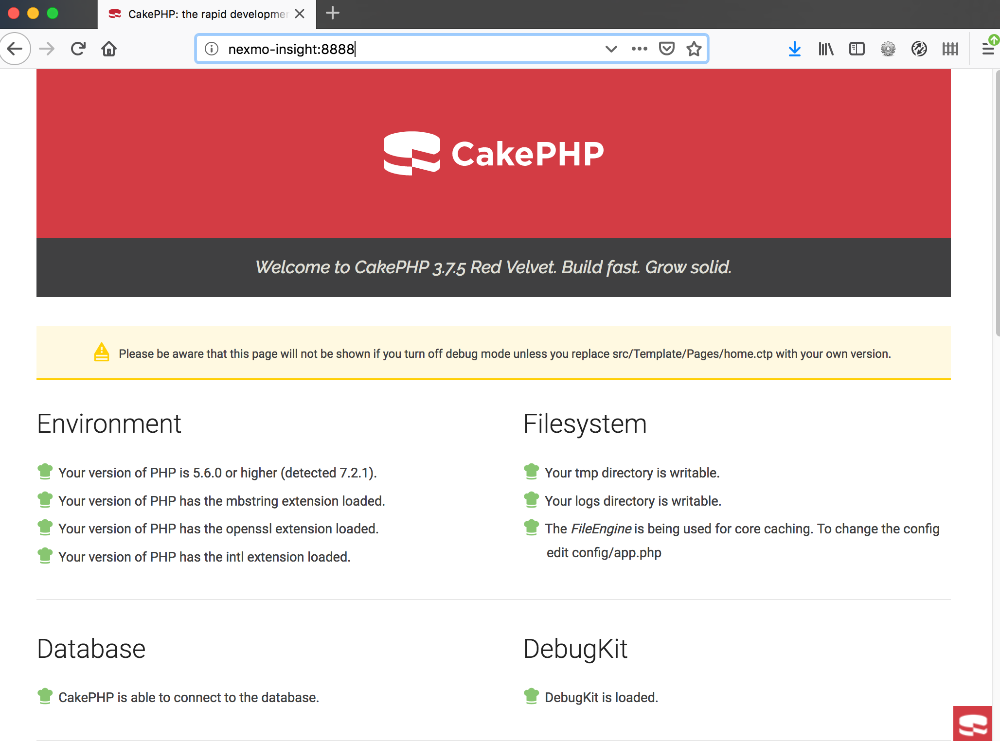

Our next step is to [generate the web site skeleton](https://book.cakephp.org/3.0/en/bake/usage.html). We'll use CakePHP's "bake" utility to generate the Model-View-Controller site structure. We're building a simple database "crud" application as our starting point. ("Crud" stands for Create, Read, Update, Delete, the standard database operations.) We have two tables, "contacts" and "formattings":

~~~~bash
	bin/cake bake all contacts
	bin/cake bake all formattings
~~~~

We can now navigate to the `/contacts` URL and see the empty table.

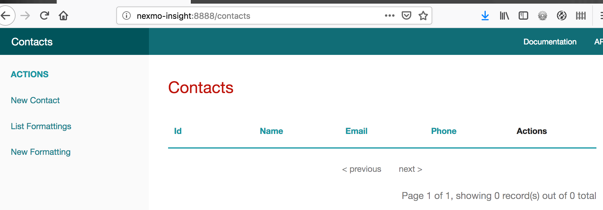

Click on "New Contact" in the left-hand navigation column. We see a standard web form. Here we've filled in the form and are ready to click "submit":

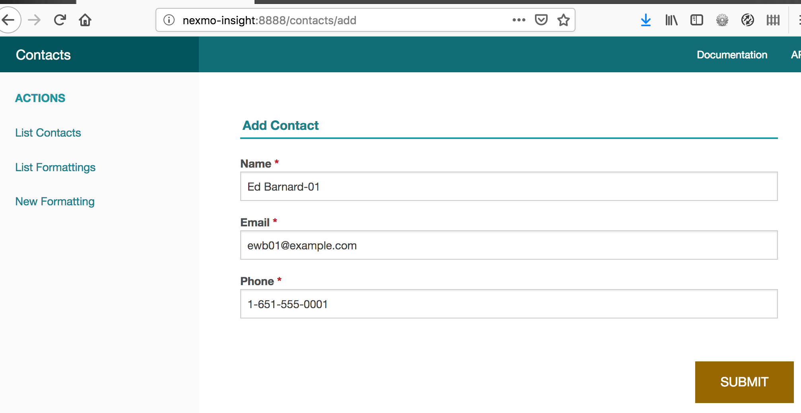

Click "submit". We now see the flash message "The contact has been saved." We've been redirected back to the "list contacts" page showing we now have one row in our table. Everything works as expected. Let's start customizing our code.

## Nexmo Number Insight API ##

Here's our initial objective. When we create or edit (update) any contact record, we want to call the Nexmo Number Insight API to obtain formatting information for that phone number based on the number's locale (based on the country code in the phone number). We are only asking for locale information because we can use that variant of the Insight API for free. For more information about the Number Insight API, see Lorna Mitchell's tutorial [How to Use the Number Insight API with PHP](https://www.nexmo.com/blog/2019/03/29/how-to-use-number-insight-with-php-dr/).

We'll be editing `src/Controller/ContactsController.php`. Add `use Nexmo\Client` near the top of the file:

~~~~php
<?php

namespace App\Controller;

use App\Model\Entity\Contact;
use Cake\Datasource\ResultSetInterface;
use Cake\ORM\TableRegistry;
use Nexmo\Client;
~~~~

Next, create a private method to call the Nexmo API and save the result in our "formattings" database table. We are ignoring the error handling one would expect for production code. We'll walk through the code below:

~~~~php
private function nexmoFormatNumber(int $contactId, string $number): void {
    $client = new Client(new Client\Credentials\Basic(NEXMO_KEY, NEXMO_SECRET));
    $insight = $client->insights()->basic($number)->jsonSerialize();
    $insight['contact_id'] = $contactId;
    $insight['intl_format_number'] = $insight['international_format_number'];
    $insight['natl_format_number'] = $insight['national_format_number'];
    $formattings = TableRegistry::getTableLocator()->get('Formattings');
    $entity = $formattings->newEntity($insight, ['associated' => []]);
    $formattings->save($entity);
}
~~~~

1. The first line creates a new client with your developer credentials.
2. The second line calls the "basic" variant of the Insights API. That's important---it's the "basic" variant that's free. Learn the technique for free.
3. The third line is the database row id of the contacts table. We're linking the "formattings" table record to the "contacts" record.
4. I shortened the column names `intl_format_number` and `natl_format_number`, but the Number Insight response comes back with the full names, so here we convert from the response key names to the database table's column names.
5. The final three lines are [CakePHP's convention for creating the database table row](https://book.cakephp.org/3.0/en/orm/saving-data.html).

Finally, we want to call the above method any time we add or edit a contact record. Both the add and edit methods contain the following block of code:

~~~~php
if ($this->Contacts->save($contact)) {
    $this->Flash->success(__('The contact has been saved.'));

    return $this->redirect(['action' => 'index']);
}
~~~~

If the save is successful (that is, either the add or edit is successful), we want to call the Nexmo API. Add one line inside the `if` block to call our Nexmo method:

~~~~php
if ($this->Contacts->save($contact)) {
    $this->nexmoFormatNumber($contact->id, $contact->phone);
    $this->Flash->success(__('The contact has been saved.'));

    return $this->redirect(['action' => 'index']);
}
~~~~

Let's try this out. First, let's edit our contact record and re-save it. That should trigger the Nexmo API call. Click Edit, then Submit, then View to see the contact record. The formatting isn't great, but it doesn't need to be at this point:

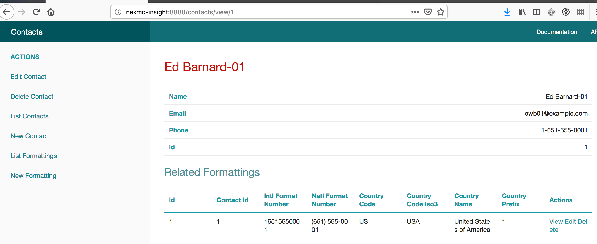

Let's add a new contact and make sure "add" works as expected.

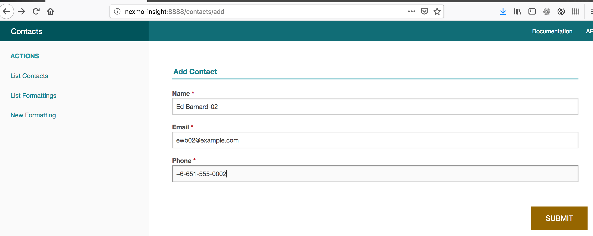

Click Submit. We now have two contacts.

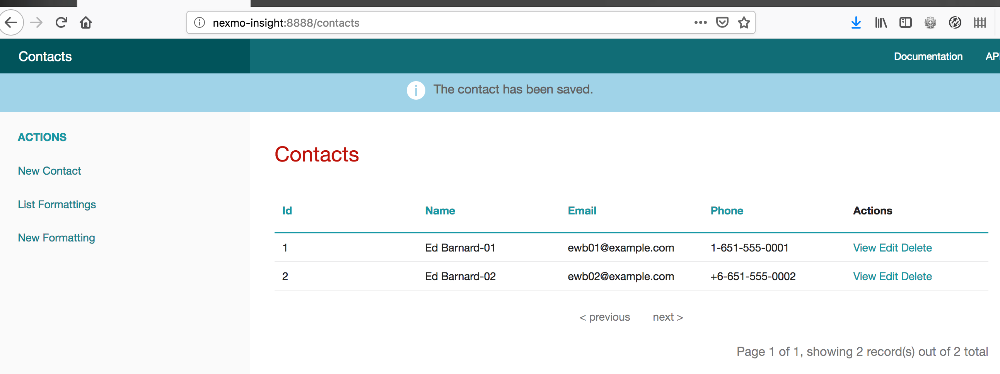

Oops! I see a typo. That phone number should begin with "+1" rather than "+6". Before we edit the record, let's view it and see what Nexmo has to say about that number.

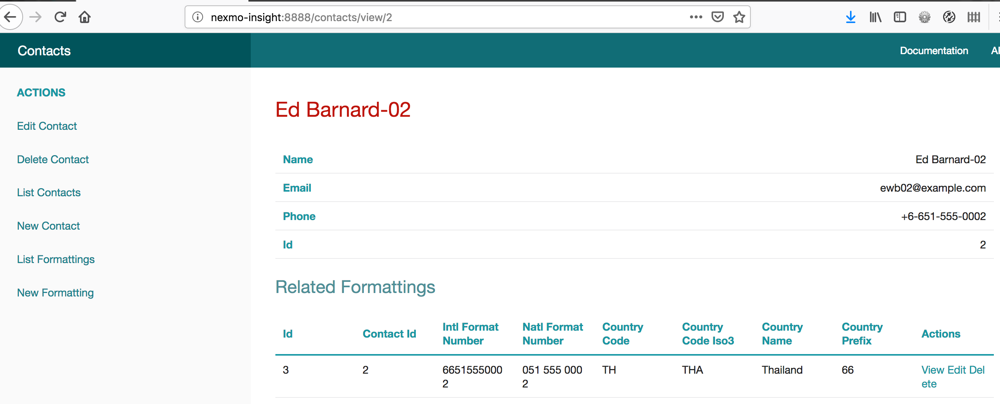

Interesting! We seem to have stumbled onto Thailand's country code. We can see why it's important to verify user-entered phone numbers prior to using them! Let's edit the number to correct the mistake and view the record once again:

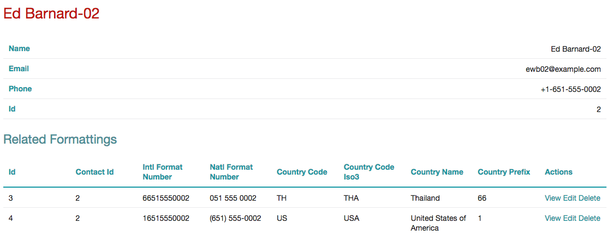

Now we have two locale-formatting records, one showing Thailand and one showing USA. Let's declare this duplication of records a Feature, not a bug.

## Moving Offline ##

Now that we have our Nexmo Number Insight API working as expected, it's time to learn a pattern for moving work offline. This pattern is generally known at the Producer/Consumer Programming pattern.

Inside the `ContactsController`, where `nexmoFormatNumber($contactId, $number)` calls the Nexmo API, we'll make a change. We'll package the input parameters (`$contactId` and `$number`) into a RabbitMQ message and send that message to our RabbitMQ exchange. This is a "fire and forget it" operation. We don't expect any sort of response, and we therefore don't await a response.

[CloudAMQP](https://www.cloudamqp.com/) provides RabbitMQ as a service. They have a free service tier designed for development projects just like this. We'll sign up and use their free service. There are many other RabbitMQ options available, including installing it yourself. It's open source software. We'll be taking advantage of their tutorials as well. Both the RabbitMQ and Nexmo APIs support several different languages. We're using PHP here but you could choose from other languages.

Log in to CloudAMQP or create an account. I created my account by signing in with my GitHub account. (The CloudAMQP screen shots are as of August 2018. Details are subject to change.)

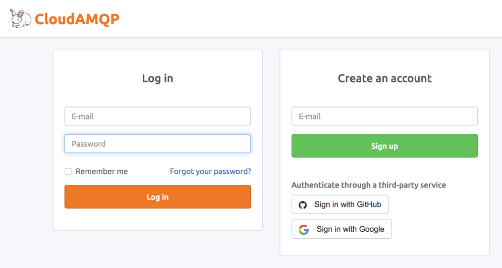

You'll reach the landing page. 

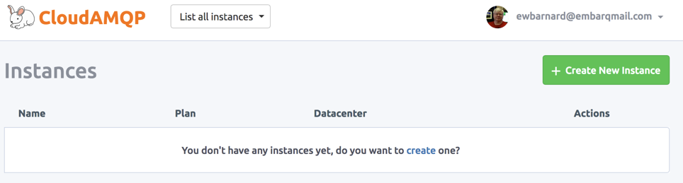

Click on the big green "Create New Instance" button.

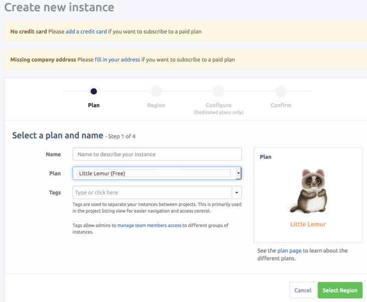

Enter a name for your RabbitMQ instance. I named mine "producer consumer 01", stayed with the free plan, did not add any tags. Then click the green "Select Region" button at the bottom right.

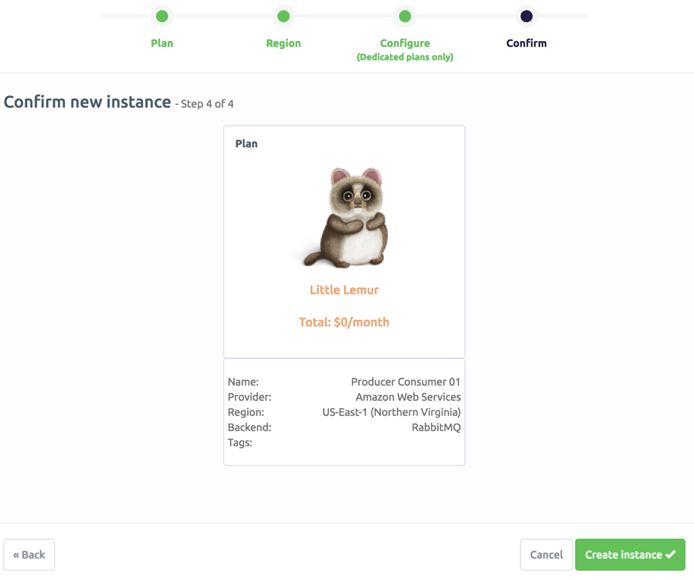

I selected the default region, leading me to the "Confirm new instance" page. Click "Create instance". That brings us to the dashboard.

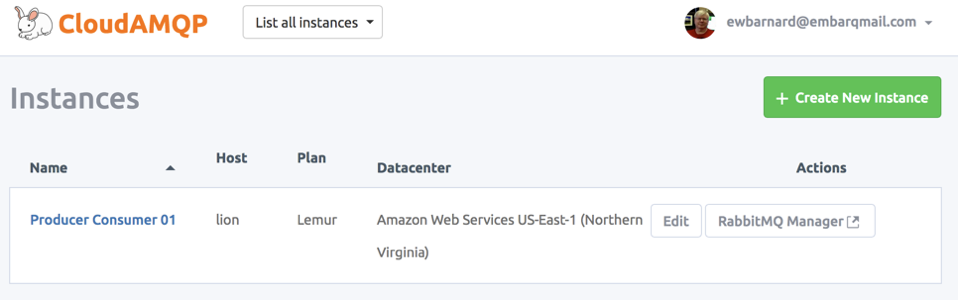

Click on your instance name (on the left) to see your instance details.

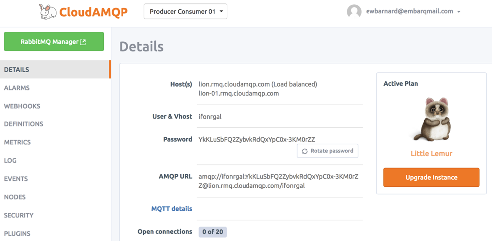

Here is where you can see the password and connection string for connecting to your RabbitMQ instance. There's a button in the middle, "Rotate password". Yes I clicked that button to change the password after making the screen shot!

That's all we need to get our code started. CloudAMQP has great [documentation](https://www.cloudamqp.com/docs/index.html) explaining how messaging works with RabbitMQ. The front documentation page has a diagram explaining what we'll be doing:

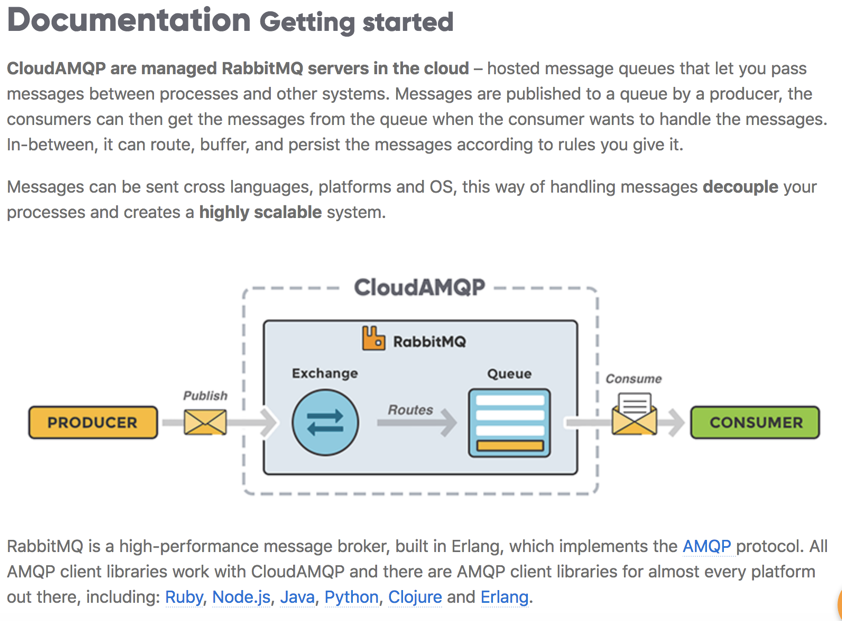

Our controller is the producer in the above diagram. We'll format a message containing `$contactId` and `$number` and publish the message to our RabbitMQ instance. There will be an offline process (which we have not yet seen) that will consume the message, call the Nexmo API, and add the response to our database table. We'll use the CloudAMQP [PHP documentation](https://www.cloudamqp.com/docs/php.html) for the connection string and the official RabbitMQ [tutorials for PHP](https://www.rabbitmq.com/tutorials/tutorial-one-php.html).

First, install the AMQP library (AMQP is the name of the protocol used by RabbitMQ):

~~~~bash
composer require php-amqplib/php-amqplib
~~~~

Add our connection string, an exchange name, and queue name to the top of `config/app.php`.

~~~~php
defined('CLOUDAMQP_URL') or define ('CLOUDAMQP_URL', 'xxx');
defined('CLOUDAMQP_EXCHANGE') or define('CLOUDAMQP_EXCHANGE', 'insight_basic_exchange');
defined('CLOUDAMQP_QUEUE') or define('CLOUDAMQP_QUEUE', 'insight_basic_queue');
~~~~

Add to our controller, src/Controller/ContactsController.php near the top:

~~~~php
use PhpAmqpLib\Channel\AMQPChannel;
use PhpAmqpLib\Connection\AMQPStreamConnection;
use PhpAmqpLib\Message\AMQPMessage;
~~~~

Update nexmoFormatNumber to publish the message:

~~~~php
private function nexmoFormatNumber(int $contactId, string $number): void {
    $url = parse_url(CLOUDAMQP_URL);
    $vhost = substr($url['path'], 1);
    $connection = new AMQPStreamConnection($url['host'], 5672, $url['user'], $url['pass'], $vhost);
    $channel = $connection->channel();
    $channel->exchange_declare(CLOUDAMQP_EXCHANGE, 'direct', false, true, false);

    $body = json_encode(['contactId' => $contactId, 'number' => $number]);
    $message = new AMQPMessage($body);
    $channel->basic_publish($message, CLOUDAMQP_EXCHANGE);
}
~~~~

We can try publishing a message by editing either of our contacts. Upon clicking "submit" we should see a message published. But how do we see it? Go to the RabbitMQ Manager. On your instance details page, there's a link (large green button) at the top left. On the main dashboard page listing all instances, it's to the right of each instance row.

The yellow triangle (inside the graph area, on the left) shows that a message was published. If you're quick, you can click on the "Exchanges" tab and see the same information. Click on "last minute" to change to a larger time span such as the last hour.

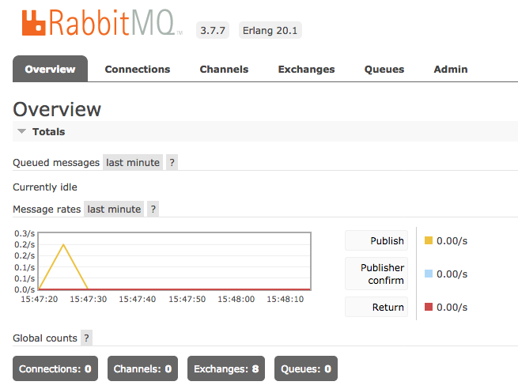

Where did the message go? Nowhere! We published the message to the RabbitMQ exchange. That's like handing a letter in to the post office. The post office looks at the envelope and decides where to deliver the message. With RabbitMQ, RabbitMQ receives the message and delivers it to whatever queue(s) it should, according to its configuration. We haven't created any queues yet, so RabbitMQ correctly delivered it to zero queues!

Let's set up the consumer. We'll set this up as a command-line "shell" using the CakePHP shell style.

First set up an empty shell class, `src/Shell/InsightShell.php`:

~~~~php
<?php

namespace App\Shell;

use Cake\Console\Shell;

class InsightShell extends Shell {
    public function main(...$args) {
        $this->verbose('Begin insight consumer');
    }
}
~~~~

Run (test) the shell as follows:

~~~~bash
bin/cake insight --verbose
~~~~

Inside `main()` we call `verbose()` with the text "Begin insight consumer". Verbose text only displays when we use the `--verbose` command-line option. The output is as expected:

~~~~bash
Begin insight consumer
~~~~

Begin the shell code the same as with the controller, that is, make the CloudAMQP connection and declare the exchange. We then continue by declaring a queue to receive the message, and connecting (binding) the queue to the exchange.

~~~~php
$url = parse_url(CLOUDAMQP_URL);
$vhost = substr($url['path'], 1);
$connection = new AMQPStreamConnection($url['host'], 5672, $url['user'], $url['pass'], $vhost);
$channel = $connection->channel();
$channel->exchange_declare(CLOUDAMQP_EXCHANGE, 'direct', false, true, false);

$channel->queue_declare(CLOUDAMQP_QUEUE, false, true, false, false);
$channel->queue_bind(CLOUDAMQP_QUEUE, CLOUDAMQP_EXCHANGE);
~~~~

The following listing shows the full consumer shell. The steps are:

1. Connect to the RabbitMQ server.
2. Declare the exchange for receiving messages.
3. Declare the queue for delivering messages.
4. Bind the queue to the exchange, so that messages published to the exchange are delivered to the queue.
5. Create a callback function for processing the received message.
6. Loop, waiting for messages to arrive.

For each message, we take the following actions:

1. Unpack the message to obtain `$contactId` and phone `$number`.
2. Call the Nexmo Insights API to obtain formatting/locale information for that number.
3. Store the Nexmo response in the database table.
4. Acknowledge receipt of the message.

Here is the full consumer shell. The code is in the GitHub repository.

~~~~php
<?php

namespace App\Shell;

use Cake\Console\Shell;
use Cake\ORM\TableRegistry;
use ErrorException;
use Exception;
use Nexmo\Client;
use PhpAmqpLib\Connection\AMQPStreamConnection;
use PhpAmqpLib\Message\AMQPMessage;

class InsightShell extends Shell {

    public function main(...$args) {
        $this->verbose('Begin insight consumer');

        $url = parse_url(CLOUDAMQP_URL);
        $vhost = substr($url['path'], 1);
        $connection = new AMQPStreamConnection($url['host'], 5672, $url['user'], $url['pass'], $vhost);
        $channel = $connection->channel();
        $channel->exchange_declare(CLOUDAMQP_EXCHANGE, 'direct', false, true, false);

        $channel->queue_declare(CLOUDAMQP_QUEUE, false, true, false, false);
        $channel->queue_bind(CLOUDAMQP_QUEUE, CLOUDAMQP_EXCHANGE);

        $callback = function (AMQPMessage $message) {
            $this->processMessage($message);
        };

        $this->verbose('Consuming...');
        $channel->basic_consume(CLOUDAMQP_QUEUE, '', false, false, false, false, $callback);

        try {
            while (count($channel->callbacks)) {
                $channel->wait();
            }
        } catch (ErrorException $e) {
            $this->out($e->getMessage());
        }

        $channel->close();
        $connection->close();
    }

    private function processMessage(AMQPMessage $message) {
        try {
            $payload = json_decode($message->body, true);
            $contactId = (int)$payload['contactId'];
            $number = (string)$payload['number'];
            $this->callNexmo($contactId, $number);
        } catch (Exception $e) {
            $this->out($e->getMessage());
        }

        $this->ackMessage($message);
    }

    private function callNexmo(int $contactId, string $number): void {
        $client = new Client(new Client\Credentials\Basic(NEXMO_KEY, NEXMO_SECRET));
        $insight = $client->insights()->basic($number)->jsonSerialize();
        $insight['contact_id'] = $contactId;
        $insight['intl_format_number'] = $insight['international_format_number'];
        $insight['natl_format_number'] = $insight['national_format_number'];
        $formattings = TableRegistry::getTableLocator()->get('Formattings');
        $entity = $formattings->newEntity($insight, ['associated' => []]);
        $formattings->save($entity);
    }

    private function ackMessage(AMQPMessage $message) {
        /** @var \PhpAmqpLib\Channel\AMQPChannel $channel */
        $channel = $message->delivery_info['channel'];
        $channel->basic_ack($message->delivery_info['delivery_tag']);
    }
}
~~~~

Now when we run the consumer we see it begin consuming, and it appears to hang:

~~~~bash
bin/cake insight --verbose
Begin insight consumer
Consuming...
~~~~

Now add a new contact record via the web site.

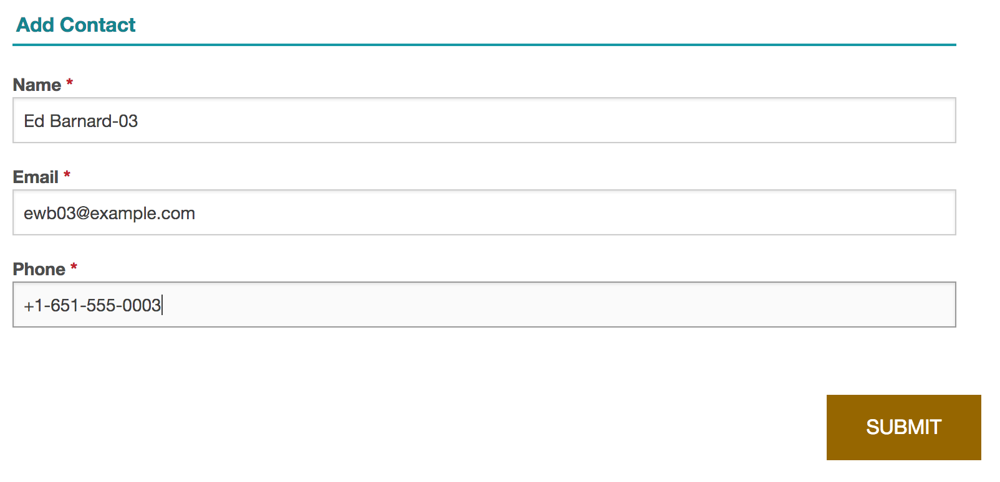

We now have three contact records:

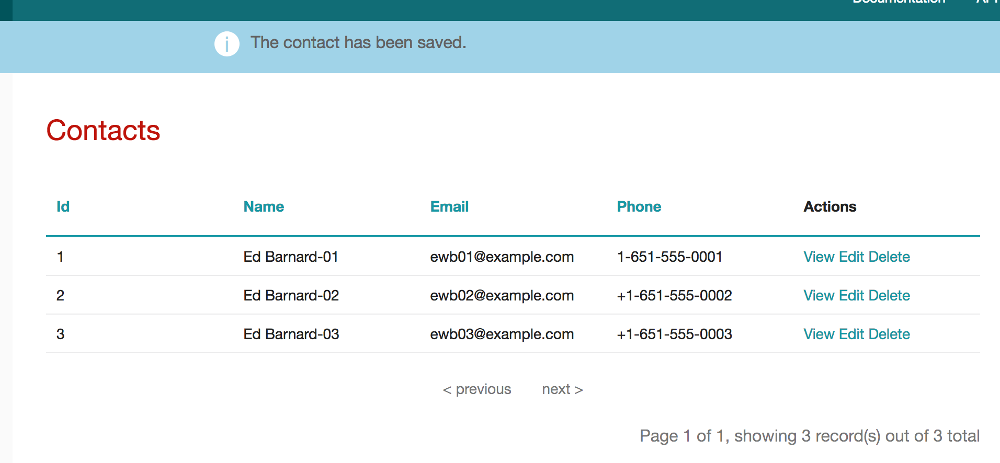

View the third record to see both the contact record and the formatting/locale information obtained from the Nexmo API. It works!

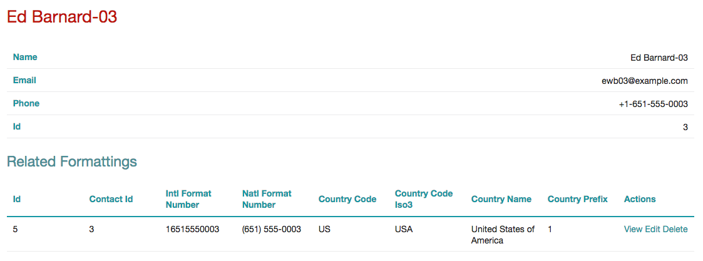

## Summary ##

We brought together two different services: the Nexmo Number Insight API, and CloudAMQP's RabbitMQ as a Service. We used the free tier of both services for developing our application.

We used the Nexmo Number Insight API for obtaining locale-specific formatting information. We saw what happens when the user mistypes the phone number, and therefore why phone number verification can be important for user-supplied phone numbers. (Varying levels of number verification come with the Standard and Advanced levels of the API.)

We then took our working prototype and changed the API call to be offline. As your applications scale and grow it can prove important to offload services such as third-party API calls.

The full working project is available on GitHub, but you'll need to supply your own credentials for the database connection, the Nexmo API, and the CloudAMQP API.