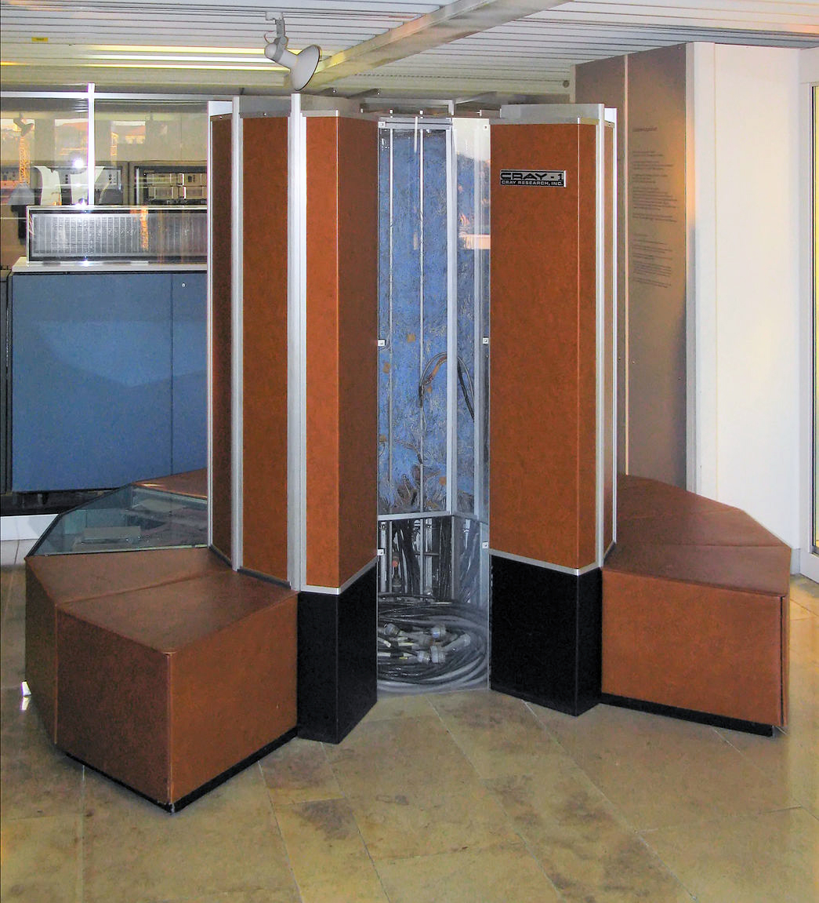
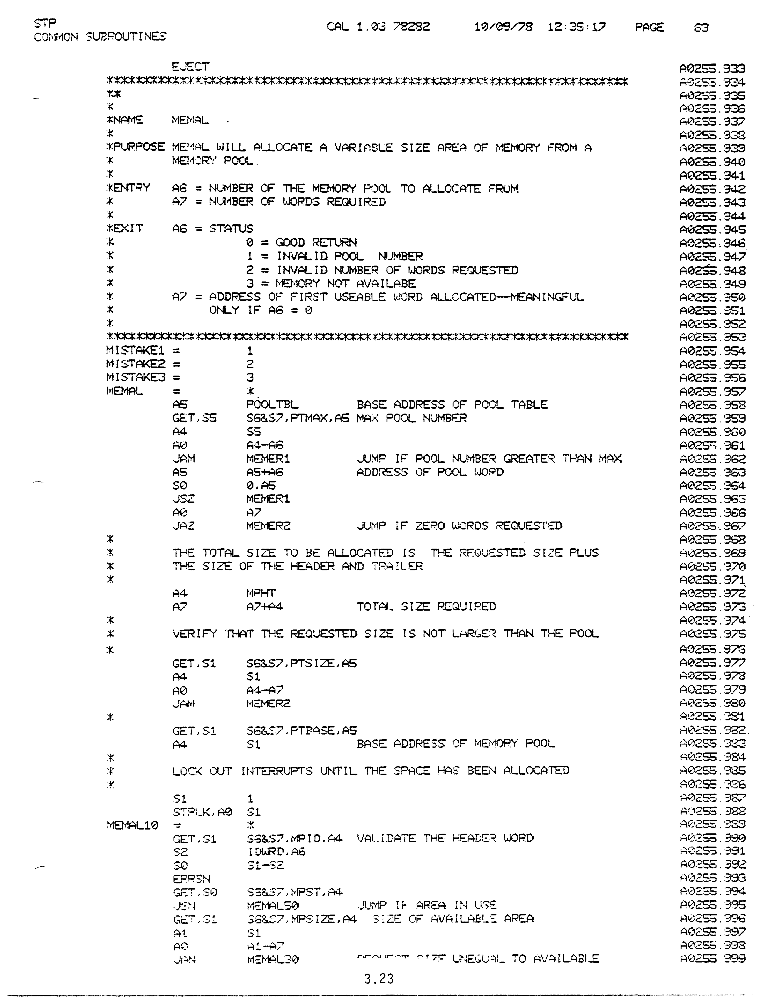
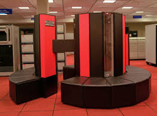
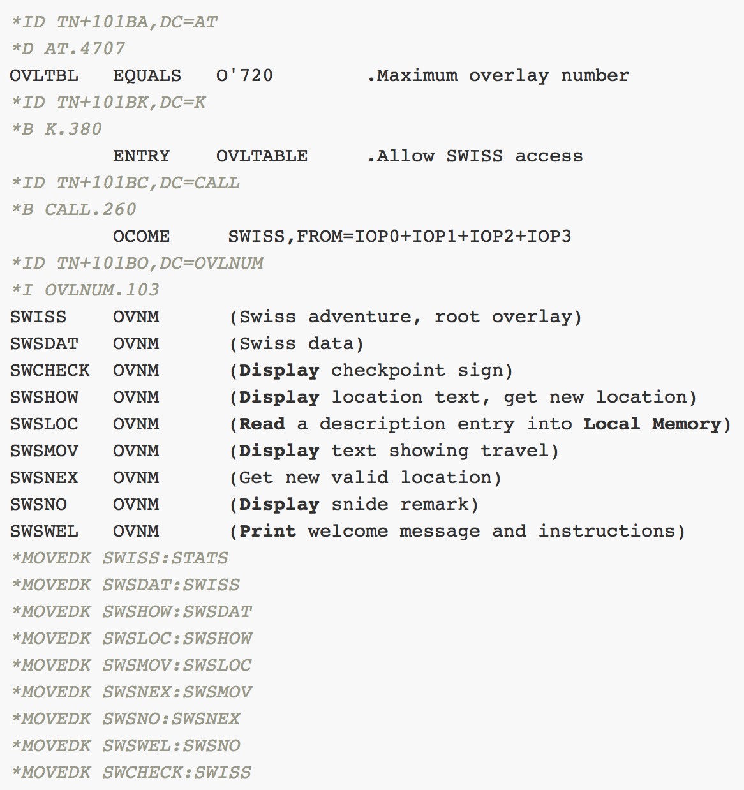

# Second Proposal

One serious, one fun.

## Tutorial Title

_Learn the Nexmo SMS APIs by Playing the 1986 Swiss Text Adventure Game_

## Tutorial Abstract

> Let's have some fun. We're going to re-create a text Adventure game from 1986. It
> was designed to secretly run on a mainframe computer's operator console. We'll
> use our smart phone's text messages to simulate that operator console as we try
> to survive our "Swiss Adventure". We'll be learning the "ins and outs" of the
> Nexmo SMS API by sending and receiving text messages from our PHP application and
> checking message-delivery receipts. We'll learn the 2-Factor Authentication
> workflow using the Nexmo Verify API.

> As developers it can be challenging to integrate with any third-party API. We need
> to understand the sequencing of events in addition to the individual requests and
> responses. On the client side that's easy. Modern browsers, and tools like the
> [Charles Web Debugging Proxy](https://www.charlesproxy.com/), can provide a complete
> picture of client-side traffic including headers and cookies. It can be more
> difficult to observe server-side interactions. We'll use a web page to display
> the API interactions (requests and responses) in near-real time as we conduct our
> Swiss Adventure via Nexmo's SMS API.

## About the App

The original "Swiss Adventure" (1986) was written for the Cray mainframe operator
console. This port uses a PHP application as the game engine and the user's smart
phone text messaging app as the operator console. Commands and responses are by
text message. The accompanying web page displays the Nexmo API requests and responses
in real time using JQuery AJAX requests.

We demonstrate two-factor authentication by entering the phone number in a web page
and following the Nexmo Verify API workflow. We mask (redact) the verification token
when displaying the API requests/responses. The verified phone number will then be
used as the adventure game's operator console.

## Target Audience

This tutorial is for intermediate and advanced back end developers (in PHP) who wish
to learn to implement Nexmo's Verify and/or SMS APIs. The application being developed
is a teaching tool rather than having any particular business use.

An interest in retro gaming is helpful but not required.

## Prerequisites

Readers should have

 - Intermediate knowledge of PHP
 - Basic knowledge of MySQL and MySQL table design
 - Basic knowledge of using Javascript with JQuery for AJAX requests
 
Familiarity with the CakePHP framework is helpful but not required.

## Learning Objectives

Readers of the tutorial can learn:

 - How to use the Nexmo Verify API for two-factor authentication
 - How to send a text message using the Nexmo SMS API
 - How to receive a text message using the Nexmo SMS API
 - How to receive a delivery receipt using the Nexmo SMS API
 - The sequencing and request/response content of the above API usage
 - How to use web sockets for inbound information from Nexmo
 
## Language and Framework

PHP 7.2 and CakePHP 3 using MySQL 5.6. Javascript and JQuery (versions to be determined)
for displaying the API requests/responses in near-real time.

## Specific Nexmo/TokBox APIs

 - Nexmo SMS (outbound SMS; delivery receipt; inbound SMS)
 - Nexmo Verify

## Related Reading

 - [cURL, HTTPS & the Nexmo SMS API Behind the Scenes](https://www.nexmo.com/blog/2018/11/06/curl-https-nexmo-sms-api-behind-the-scenes-dr/)
 - [Verify API Overview](https://developer.nexmo.com/verify/overview)
 - [SMS API Overview](https://developer.nexmo.com/messaging/sms/overview)
 - [Connect your local development server to the Nexmo API using an ngrok tunnel](https://www.nexmo.com/blog/2017/07/04/local-development-nexmo-ngrok-tunnel-dr/)
 - [Two-way SMS for customer engagement](https://developer.nexmo.com/tutorials/two-way-sms-for-customer-engagement)
 - [How to Show SMS Notifications in the Browser with Angular, Node.JS, and Ably](https://www.nexmo.com/blog/2018/08/07/sms-notifications-browser-with-angular-node-ably-dr/)
 - [Create Your Own Adventure](https://github.com/nexmo-community/create-your-own-adventure) - provided
   by the Nexmo community
 - [Swiss Adventure](https://github.com/ewbarnard/InsidePHP/blob/master/APML/swiss.txt) - the original
   text adventure, written in Cray I/O Subsystem Assembly Language
   
## External Submissions

 - [PHP Architect Magazine](https://www.phparch.com/) - for any PHP-centric projects that teach concepts
 - [freeCodeCamp](https://medium.freecodecamp.org/) - any developer-centric articles/tutorials
 - [Dev.to](https://dev.to/) - any developer-centric articles/tutorials
 - [codementor](https://www.codementor.io/community/trending) - any developer-centric tutorials
 - [scotch.io](https://scotch.io/) - any web development tutorials, thus plausibly anything PHP-centric
 - [Digital Ocean Community](https://www.digitalocean.com/community/tutorials) - any developer-centric tutorials
 - [LinkedIn](https://www.linkedin.com/) - anything purporting to be informative
 - [CakePHP Blog](https://bakery.cakephp.org/) - Anything built as a demo project with the CakePHP framework
   could be a topic for the FriendsOfCake group or the CakePHP Bakery blog. I can check with the core development
   team when the time comes.
   
## Three Tweets

The following tweets should include an image; perhaps even just a screen shot of the code.

1. Retro Computing: Learn the @Nexmo SMS API by playing the 1986 text Adventure game that takes you around Switzerland!

2. "You have found the highest rail station in Europe. The Jungfrau, Eiger, and Monch display their deadly beauty." - learn how @Nexmo APIs work while you play the 1986 Adventure game using text messages to simulate your mainframe operator console.

3. "As you climb through the trap door..." - Let's learn about text messages the fun way! This tutorial uses a 1986 adventure game to teach how to use the @Nexmo 2-factor verification and SMS APIs. Your phone becomes the operator console.

The following long-form Twitter thread begins with the back story.
Persons with a retro gaming interest will pick up on the importance of the back story.

1. Once upon a time, I had an Adventure. That's me on the left, 9 years earlier, out for a different Adventure. THREAD

2. In fact I wrote the Adventure... as a game. All you gamers out there will know that the back story is important. That's me seated, far left, on that prior adventure. So what's the story?

3. Retro gaming means we need to step back in time... in our case, to 1986. The original Nintendo Entertainment System was just being introduced. The Legend of Zelda would appear the following year. <https://en.wikipedia.org/wiki/History_of_Nintendo#Game_&_Watch_and_Nintendo_Entertainment_System>

4. I'd never heard of Nintendo... but I'd played and solved Zork, and the original Colossal Cave Adventure. These text-based games defined the "text Adventure" genre of the era. <https://en.wikipedia.org/wiki/Zork>

5. For me, in 1986, "computing" meant Supercomputing. The Cray Research mainframes were the world's fastest computers. These Cray mainframes become our gaming story.

6. People came to Cray Research to learn how to program their own supercomputer. With so few in existence there were no other options. The months-long training sequence optionally included the operating system internals (yuck).

7. Yes, as late as the 1980s, the operating system courses were all in assembly language.

8. In fact there were TWO operating systems to learn. First we learned the Cray mainframe itself, and then we moved on to the mysterious I/O Subsystem, a rack of custom mini-supercomputers with only 128 KBytes of memory. But fast... oh, so fast.

9. I was moving back to Cray Research headquarters to teach the operating system internals (yuck). I sat through the entire operating system sequence, since I would soon be teaching part of it.

10. I'd be teaching the mainframe part, so I didn't need to worry about the I/O Subsystem (IOS) part. Yay! But I still had to sit through those two weeks and learn the IOS stuff anyway.

11. The IOS class includes a class project. Each student needs to write an "overlay" that does something, much like "Hello World".

12. That sounds trivial, but it isn't. It's something like writing an extension to the Linux kernel.

13. The student overlay needs to get registered with the rest of the operating system software. (Yes this really is the Adventure back story...)

14. We need to boot the multi-million-dollar mainframe with the modified IOS software. When something doesn't work as expected, the instructor may or may not be able to help.

15. Rebuilding the software might mean waiting until the next day for another try... and we're already at the last couple of class days.

16. Most students completed the assigment as 20-30 lines of code: Display something on the operator console and exit.

17. I, on the other hand, asked around. Had anyone ever created a game program as their assignment?

18. Nope. Never been done. With limited class time and very limited test time, there's good reason that new students never made the attempt, in a new just-learned assembly language.

19. So I wrote an adventure game, inspired by the now-ancient Colossal Cave Adventure program. It's text-based interactive fiction. This was the mid-1980s, after all!

20. It's a tour of Switzerland, with a maze of twisty passages all nearly alike, and a final puzzle involving Arabic words. We had just moved back to Minnesota after living in Saudi Arabia, thus a challenge in Arabic seemed like the right thing to do.

21. The program did have a problem, which I considered a feature at the time.

22. You could not exit the program except by winning (completing) it. One had to solve the whole thing or reboot the Cray mainframe. Oops!

23. Those 1500 lines of I/O Subsystem assembler code are now, so far as I know, the largest surviving example of Cray I/O Subsystem source code. Computing museum curators are actually out there looking for Cray Operating System source code to no avail.

24. Funny thing... five years later I joined the I/O Subsystem software development team. In the software industry, when you put in the effort to achieve something weird, the effort may eventually pay off in an interesting way.

25. That's the back story from 1986. Very few people ever got to play Swiss Adventure, both because it was silly and because it was hidden within the operating system. It had to be played on the Cray supercomputer's physical operator console. Few had physical access.

26. What good does this do us today? I turned the back story into a teaching tool. For you, if you choose to accept the challenge!

27. Operator consoles of the era were entirely text-based. Type something in and the computer types something back. You know... just like text messages work today. Aha!

28. We're going to implement Swiss Adventure using your smart phone's text messaging capability as the operator console.

29. This means that you'll learn how to verify that you control the "operator console" phone number. That is, you'll implement 2-factor authentication in PHP using the @Nexmo Verify API.

30. This also means that you'll learn how to use @Nexmo's SMS API to send and receive text messages to and from your very own "operator console" and check delivery receipts.

31. Perhaps more importantly you'll be observing the SEQUENCING of the API requests and responses. You may or may not survive your Swiss Adventure but you'll sure understand how to use those APIs!

32. "You discover the Lion of Luzern..." our Retro Computing tutorial begins here. <https://github.com/ewbarnard/NexmoInsight/blob/master/Proposals/TextAdventure.md>

33. Every retro gamer knows about cheat mode... right? You are welcome to trace your way through your Swiss Adventure by studying the original source code. I've placed it online with an MIT Open Source license.

34. It's 1,523 lines of assembler. So the question is... how badly do you want to cheat? Ha! END <https://github.com/ewbarnard/InsidePHP/blob/master/APML/swiss.txt>

## Call for Papers

This tutorial is suitable as both a regular talk (60 minutes, intermediate) and as a hands-on workshop
(3 hours, intermediate, need ngrok and LAMP stack or equivalent).

### Talk Titles

 - Retro Computing: Simulate an Operator Console using Text Messages
 - Learn the Nexmo SMS APIs by playing the 1986 Swiss Adventure Game
 
### Talk Description

Let's have some fun. We're going to re-create a text Adventure game from 1986 - but
it required an operator console. We'll send and receive text messages to simulate
that console. We'll use Nexmo's SMS API for messaging and Verify API for 2-factor
authentication.
